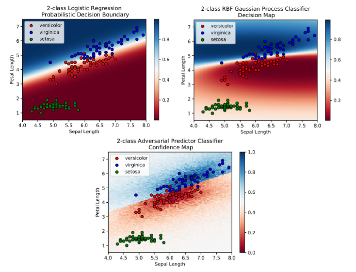

# Adversarial Predictor
This is a part of my masters final project. It is the application of monte carlo simulations based algorithm idea that provide a "more dependable" (see description pdf) confidence metrics for any discriminative classifier.

